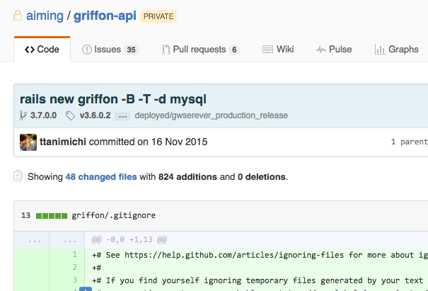

footer: (C) Tsukuru Tanimichi, 2016
slidenumbers: true

# 大規模 Padrino
# アプリケーション
# Rails 移行

## Migrate to Rails from Padrino

### 2016/04/11 @ttanimichi

---

# 自己紹介

- プログラマ
- Ruby, DevOps, Java
- 2014年6月〜現在 株式会社Aiming
  - もともと基盤側を作っていた。最近ゲームタイトルに異動
- https://github.com/ttanimichi

---

# 幻塔戦記グリフォン


---

# 環境

- Ruby 2.0
- **Padrino 0.11**
- MySQL 5.5
- nginx
- Redis


---

# rake stats

```sh
% bin/rake stats
+----------------------+-------+-------+---------+---------+-----+-------+
| Name                 | Lines |   LOC | Classes | Methods | M/C | LOC/M |
+----------------------+-------+-------+---------+---------+-----+-------+
| Controllers          |  2984 |  2566 |      50 |     302 |   6 |     6 |
| Helpers              |    86 |    86 |       0 |       1 |   0 |    84 |
| Models               | 15810 | 13029 |     422 |    1513 |   3 |     6 |
| Mailers              |     0 |     0 |       0 |       0 |   0 |     0 |
| Javascripts          | 11577 |  7916 |       1 |     809 | 809 |     7 |
| Libraries            | 19329 | 13621 |     693 |    1754 |   2 |     5 |
| Controller specs     |   223 |   181 |       0 |       2 |   0 |    88 |
| Lib specs            |  4404 |  3603 |       6 |       6 |   1 |   598 |
| Model specs          | 31852 | 26255 |       0 |      19 |   0 |  1379 |
| Request specs        |    15 |    13 |       0 |       0 |   0 |     0 |
| Service specs        | 24027 | 19808 |       3 |      37 |  12 |   533 |
+----------------------+-------+-------+---------+---------+-----+-------+
| Total                | 110307 | 87078 |    1175 |    4443 |   3 |    17 |
+----------------------+-------+-------+---------+---------+-----+-------+
  Code LOC: 37218     Test LOC: 49860     Code to Test Ratio: 1:1.3
```

---

# rake stats

```sh
% bin/rake stats
+----------------------+-------+-------+---------+---------+-----+-------+
| Name                 | Lines |   LOC | Classes | Methods | M/C | LOC/M |
...
| Models               | 15810 | 13029 |     422 |    1513 |   3 |     6 |
...
+----------------------+-------+-------+---------+---------+-----+-------+
```

## 400 Models

---


---

## [fit] COOKPAD で 1500 Models
## [fit] COOKPAD の 1/3 くらい？？

---

# [fit] 世界最大の Padrino アプリケーション？？

---

# つらみ

- rake spec に1時間かかる
- autoload 使ってない
  - 起動にN分くらいかかる
- AR のキャッシュが効いてない

---

# 依存ライブラリ

- activerecord 3.2
- activesupport 3.2

## つまり、ほとんど Rails3

---

# [fit] これ Rails に移行できるんじゃね？

---

# ついカッとなって...



---


