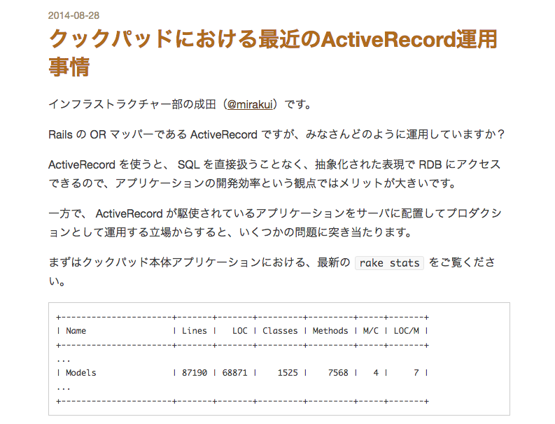
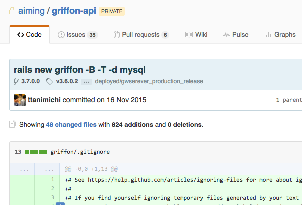
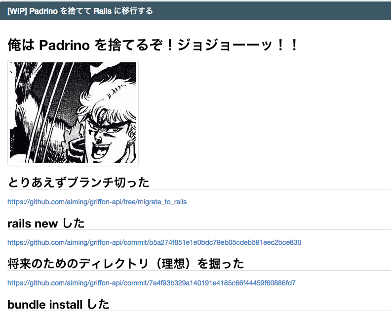
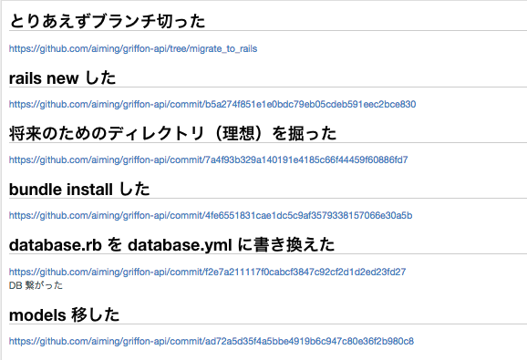
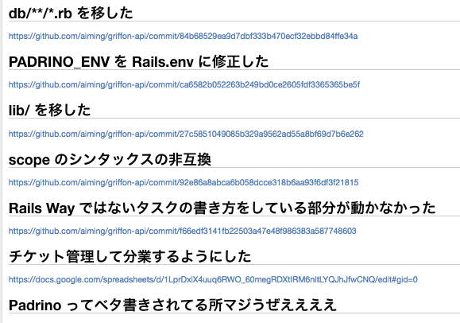
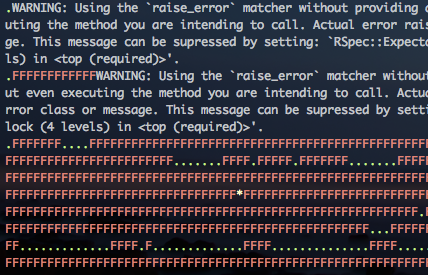

footer: (C) Tsukuru Tanimichi, 2016
slidenumbers: true

# 大規模 Padrino
# アプリケーション
# Rails 移行

### 2016/04/27 @ttanimichi

---

# 自己紹介

- @ttanimichi
- 2014年6月〜 株式会社 Aiming
  - 共通基盤の開発をしていた
  - 最近ゲームタイトルに異動
- https://github.com/ttanimichi
- info@ttanimichi.com

---

# 幻塔戦記グリフォン


---

# 環境

- Ruby 2.0
- **Padrino 0.11**
- MySQL 5.5
- nginx
- Redis


---

# rake stats

```sh
% bin/rake stats
+----------------------+-------+-------+---------+---------+-----+-------+
| Name                 | Lines |   LOC | Classes | Methods | M/C | LOC/M |
+----------------------+-------+-------+---------+---------+-----+-------+
| Controllers          |  2984 |  2566 |      50 |     302 |   6 |     6 |
| Helpers              |    86 |    86 |       0 |       1 |   0 |    84 |
| Models               | 15810 | 13029 |     422 |    1513 |   3 |     6 |
| Mailers              |     0 |     0 |       0 |       0 |   0 |     0 |
| Javascripts          | 11577 |  7916 |       1 |     809 | 809 |     7 |
| Libraries            | 19329 | 13621 |     693 |    1754 |   2 |     5 |
| Controller specs     |   223 |   181 |       0 |       2 |   0 |    88 |
| Lib specs            |  4404 |  3603 |       6 |       6 |   1 |   598 |
| Model specs          | 31852 | 26255 |       0 |      19 |   0 |  1379 |
| Request specs        |    15 |    13 |       0 |       0 |   0 |     0 |
| Service specs        | 24027 | 19808 |       3 |      37 |  12 |   533 |
+----------------------+-------+-------+---------+---------+-----+-------+
| Total                | 110307 | 87078 |    1175 |    4443 |   3 |    17 |
+----------------------+-------+-------+---------+---------+-----+-------+
  Code LOC: 37218     Test LOC: 49860     Code to Test Ratio: 1:1.3
```

---

# rake stats

```sh
% bin/rake stats
+----------------------+-------+-------+---------+---------+-----+-------+
| Name                 | Lines |   LOC | Classes | Methods | M/C | LOC/M |
...
| Models               | 15810 | 13029 |     422 |    1513 |   3 |     6 |
...
+----------------------+-------+-------+---------+---------+-----+-------+
```

## 400 Models

---



---

# rake stats

- COOKPAD で 1500 Models
- `lib/` 以下にも Model っぽいクラスが100個くらいあった
- あわせると 500 Models くらい
- COOKPAD の 1/3 くらい？？

---

# [fit] 世界最大の Padrino アプリケーション？？

---

# つらみ

- rake spec に1時間かかる
- autoload 使ってなかった
  - 起動に2分くらいかかる
  - spec 一件実行するだけでも2分
- AR のキャッシュが効いてないっぽい？？

---

# 依存ライブラリ

- activerecord 3.2
- activesupport 3.2

## つまり、ほとんど Rails3

---

# [fit] これ Rails に移行できるんじゃね？

---

# ついカッとなって...



---



---

# 移行コスト

- Padrino から Rails への移行
- activerecord のバージョンを上げる
- activesupport のバージョンを上げる
- ついでに Ruby のバージョンも上げる

---

# 方針

- まずは Rails4 で動かすことだけ考える
- 「ついでにリファクタリング」は認めない
- 機械的に移行作業だけする
- リファクタリングや細かい改善は移行後にいくらでもできる

---

# 方針

- Railsへの移行という「大きい問題」
  - 同時にリファクタリングもしはじめると永遠に移行作業が完了しない
  - ビジネス側がキレる → 移行が失敗
- とにかく機械的に移行する
  - 何も考えずに spec がコケている所を直す

---

# 移行手順

- とにかくまずはディレクトリ構造を作る
- Padrino 側から Models などを移していく
- `bundle exec rspec` が動くところまでは一人でもってく
  - `rails new`
  - `rails generate rspec:install`
  - database.yml の設定とか

---



---



---

# bundle exec rspec 動いた

- ここから先はメンバーに作業を振る
- とにかく spec さえ動けば分業できる
- 分担して spec がコケている部分を修正

---

# 盛大にコケる spec

---



---

# 盛大にコケる spec

- どんだけコケてても spec が動きさえすれば修正はメンバーに分担できる
- Active Record 3 と 4 の非互換とか
- 設定まわりの問題
- padrino helper への依存
  - 同じ名前のメソッドを定義して rails の helper へアクセスするよう修正

---

# できました

```sh
% rails -v
Rails 4.2.4

% ruby -v
ruby 2.3.0p0 (2015-12-25 revision 53290) [x86_64-darwin14]
```

### 本番環境で既に動いてます

---

# 振り返り

---


---

# 振り返り

- 移行コストに見合うだけのメリットがあったのかなかったのかは「分からない」
- メンバーの開発に対するモチベーションアップ
- 大掛かりな移行には勇気と決断力が必要
- Padrino のまま最低限の改善だけするって選択肢もアリだったかも

---

# おまけ

---

# 管理画面

- 本体と管理画面は別アプリケーション
- 管理ツール側は本体側の Model を参照
- 管理ツール側は一旦 Padrino のまま残した
- 一部の Model が Rails.env に依存（良くない）
- Padrino の場合は Padrino.env を参照したい

---

# Rails = Padrino キタコレ

```
Rails = Padrino
Rails.env #=> "development"
```

初期化時に Rails という定数を定義

※ ネタです
※ 管理画面も Rails への移行作業を今しているよ
※ 管理画面の Rails 移行もほとんど完了

---

# [fit] ご静聴ありがとうございました
